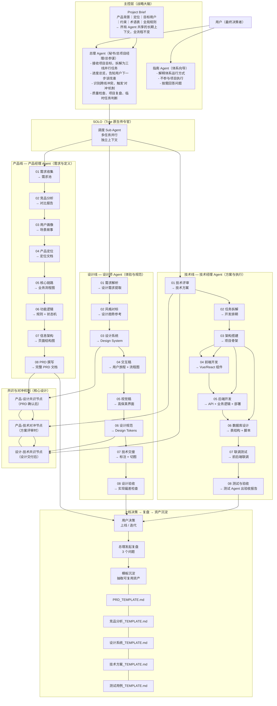

```mermaid
flowchart TD
    User["用户（最终决策者）"]

    subgraph ControlLayer["主控层（战略大脑）"]
        Brief["Project Brief<br>产品背景｜定位｜目标用户｜约束｜术语表｜全局规则<br>← 所有 Agent 共享的长期上下文，全流程不变"]
        Director["总理 Agent（秘书/总项目经理/总参谋）<br>- 接收项目目标，拆解为三线并行任务<br>- 进度总览，告知用户下一步该找谁<br>- 识别跨线冲突，触发'对冲'机制<br>- 质量检查、项目复盘、临时任务判断"]
        Guide["指南 Agent（体系向导）<br>- 解释体系运行方式<br>- 不参与项目执行<br>- 按需回答问题"]
    end

    subgraph SOLOLayer["SOLO（Trae 原生传令官）"]
        S1["调度 Sub Agent<br>多任务并行<br>独立上下文"]
    end

    subgraph ProductLine["产品线 — 产品经理 Agent（需求与定义）"]
        direction LR
        P1["01 需求收集<br>→ 需求池"]
        P2["02 竞品分析<br>→ 对比报告"]
        P3["03 用户画像<br>→ 场景故事"]
        P4["04 产品定位<br>→ 定位文档"]
        P5["05 核心链路<br>→ 业务流程图"]
        P6["06 功能逻辑<br>→ 规则 + 状态机"]
        P7["07 信息架构<br>→ 页面结构图"]
        P8["08 PRD 撰写<br>→ 完整 PRD 文档"]
        P1 --> P2 --> P3 --> P4 --> P5 --> P6 --> P7 --> P8
    end

    subgraph DesignLine["设计线 — 设计师 Agent（体验与规范）"]
        direction LR
        D1["01 需求解析<br>→ 设计需求提取"]
        D2["02 风格对标<br>→ 设计趋势参考"]
        D3["03 设计系统<br>→ Design System"]
        D4["04 交互稿<br>→ 用户旅程 + 流程图"]
        D5["05 视觉稿<br>→ 高保真界面"]
        D6["06 设计规范<br>→ Design Tokens"]
        D7["07 技术交接<br>→ 标注 + 切图"]
        D8["08 设计验收<br>→ 实现偏差检查"]
        D1 --> D2 --> D3 --> D4 --> D5 --> D6 --> D7 --> D8
    end

    subgraph TechLine["技术线 — 技术经理 Agent（方案与执行）"]
        direction LR
        T1["01 技术评审<br>→ 技术方案"]
        T2["02 任务拆解<br>→ 开发排期"]
        T3["03 架构搭建<br>→ 项目骨架"]
        T4["04 前端开发<br>→ Vue/React 组件"]
        T5["05 后端开发<br>→ API + 业务逻辑 + 部署"]
        T6["06 数据库设计<br>→ 表结构 + 脚本"]
        T7["07 联调测试<br>→ 前后端联调"]
        T8["08 测试与验收<br>→ 测试 Agent 出验收报告"]
        T1 --> T2 --> T3 --> T4 --> T5 --> T6 --> T7 --> T8
    end

    subgraph Consensus["共识与对冲机制（核心设计）"]
        direction LR
        C1["产品-设计共识节点<br>（PRD 确认后）"]
        C2["产品-技术对冲节点<br>（方案评审时）"]
        C3["设计-技术共识节点<br>（设计交付后）"]
        C1 --- C2 --- C3
    end

    subgraph Decision["上线决策 → 复盘 → 资产沉淀"]
        direction LR
        A1["用户决策<br>上线 / 迭代"]
        A2["总理发起复盘<br>3 个问题"]
        A3["模板沉淀<br>抽取可复用资产"]
        A1 --> A2 --> A3
        M1["PRD_TEMPLATE.md"]
        M2["竞品分析_TEMPLATE.md"]
        M3["设计系统_TEMPLATE.md"]
        M4["技术方案_TEMPLATE.md"]
        M5["测试用例_TEMPLATE.md"]
        A3 --- M1 --- M2 --- M3 --- M4 --- M5
    end

    User --> Director
    User --> Guide
    Brief --> Director
    Director --> S1
    S1 --> P1
    S1 --> D1
    S1 --> T1

    P8 --> C1
    D3 --> C1
    C1 --> C2
    T1 --> C2
    C2 --> C3
    D6 --> C3
    T1 --> C3

    T3 --> T4
    T3 --> T5
    T3 --> T6

    P8 --> A1
    D8 --> A1
    T8 --> A1
```
